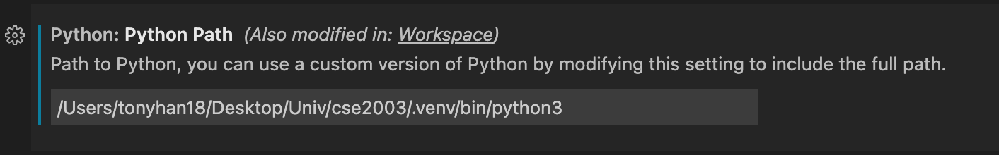

# CSE2003 기초공학설계 실습, 과제 
  
2021년 상반기에 실시한 기초공학설계의 실습, 과제 답안 
전체 만점 받음 
 

---

 

## 과제 12부터

vscode에서 실행시 가상환경 설정은 필수임 
그래서 .venv에 가상환경을 설치해두었으니 해당 환경을 실행하면 됨 
혹은 새롭게 가상환경을 만들어서 패키지를 다운 받을 것 
  

### 그냥 실행하는 방법
`source .venv/bin/activate` 
  

### 가상환경 만들고 설치하는 방법 
`python3 -m venv .venv` 
`source .venv/bin/activate` 
`pip install numpy` 
`pip install matplotlib` 
  

- MAC VSCode 에서 실행 
vscode에서 settings > python path를 가상환경으로 바꾸어 주어야 함 

- WIN VSCode 에서 실행 
win에서는 딱히 가상환경이 없어도 됨 
`python3 -m pip install --user numpy matplotlib` 으로 설치하고 바로 실행 

